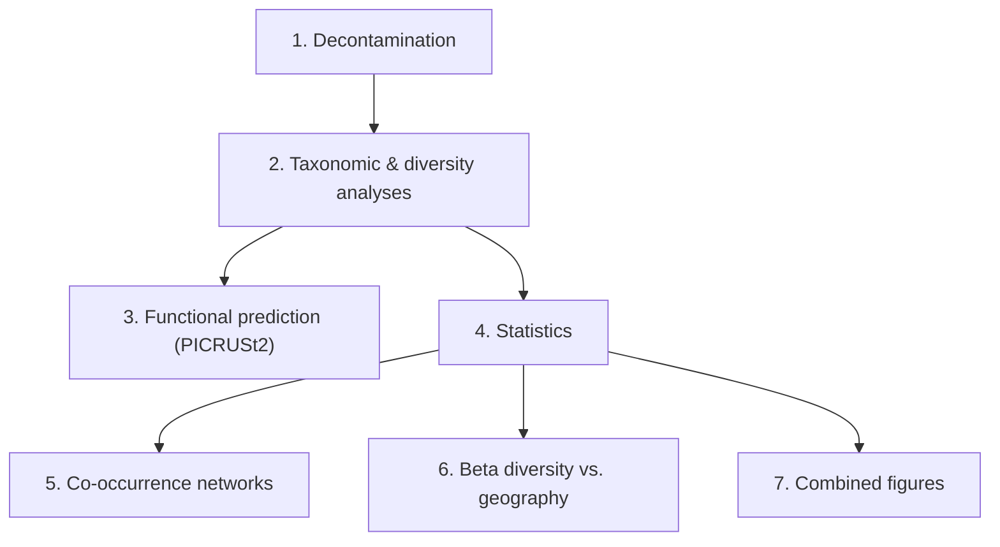

# Microbiome_baseline 🐝 🧬🦠

Data and analysis code for the microbiome (16S bacteria + ITS fungi) composition of *Bombus pascuorum* individuals sampled through time and space in Gorbea Natural Park ([GorBEEa project](https://gorbeea.bc3research.org/)), together with floral resource data.

> Chueca Luis J., Poza Jon, Dhami Manpreet K., Donald Marion L., Gostout Christian, Hermosilla Brais, Rose Jennifer, Salgado-Irazabal Xabier & Magrach Ainhoa. **Seasonality and spatial context shape the gut microbiome diversity of the common carder bee *Bombus pascuorum***. *in prep*.

Raw ASVs were obtained with the [DADA2_pipeline](https://github.com/GorBEEa/DADA2) repository.

## Pipeline overview

Bacteria and fungi are processed as **parallel tracks through the same pipeline stages**, not a single linear sequence — most numbered scripts below have a bacteria and a fungi counterpart that mirror each other in naming and logic.

## 1. Decontamination

Builds a `phyloseq` object from the raw DADA2 output and removes putative contaminants with the [decontam](https://github.com/benjjneb/decontam) R package, testing several abundance thresholds per plate. Outputs a cleaned phyloseq object (`data/ps.gbp23*.RDS`), an ASV count table, and library-size diagnostic plots.

* `scripts/01_decotam_bacteria_v2.R` — bacteria (16S), current version, contaminants assessed **per plate**.
* `scripts/01_decotam.R` — bacteria (16S), legacy single-threshold version.
* `scripts/01_decotam_fungi.R` — fungi (ITS).

## 2. Taxonomic & diversity analyses

For each domain: beta diversity (DESeq2 variance-stabilizing transformation + PCoA + PERMANOVA, compared by sampling period, site, and floral-richness category), alpha diversity (Chao1, Shannon, rarefaction curves, non-parametric group comparisons), and taxonomic composition summaries (phylum/class/genus relative abundance plots). Results are bundled into an `.RData` file consumed by later scripts.

* `scripts/02_GBP_microbiota_analyses.R` — bacteria → `bpas_bacteria.RData`
* `scripts/02_GBP_fungi_analyses.R` — fungi → `bpas_fungi.RData` (also loads the bacteria bundle to build combined bacteria+fungi comparison figures)

## 3. Functional prediction (PICRUSt2)

Predicts functional (KO/KEGG pathway) abundances from 16S ASVs and tests for differential abundance between floral-richness categories.

* `scripts/03_PICRUSt2.sh` — runs the external `picrust2_pipeline.py` on a filtered fasta + ASV table for a given abundance threshold, writing to `data/picrust2_output_<Th>/`.
* `scripts/03.2_PICRUSt2_v2.R` — uses [`ggpicrust2`](https://github.com/cafferychen777/ggpicrust2) to turn KEGG pathway abundances into ALDEx2 differential-abundance plots and tables.

## 4. Statistics

`scripts/04_stats_ainhoa.R` — the core statistics script (~4,100 lines), covering sampling completeness (`iNEXT`), Shannon diversity comparisons, NMDS/PERMANOVA beta diversity, and floral-richness relationships, repeated in near-identical blocks for **bacteria**, **fungi**, and **plant (gut content)** data. Individual plot objects are saved to `results/RData/*.RData` so later scripts can reload a single figure without rerunning the analysis.

## 5. Co-occurrence networks

Builds and visualizes a tripartite plant/bacteria/fungi co-occurrence network (CLR transformation + correlation), after removing chloroplast ASVs from the bacterial taxonomy.

* `scripts/05_co-occurrence_networks.R` — builds the network and computes the hub-taxa strength table (`results/Table_Sy_top_strength_hubs.csv`).
* `scripts/06_co_occurrence_igraph.R` — `igraph`/`ggraph`/`tidygraph` visualization of the network, with domain-colored vertices (Plants/Bacteria/Fungi) and signed edges.

## 6. Beta diversity vs. geography

`scripts/06_beta_diversity.R` — joins site coordinates (`data/coor.csv`) to community data and relates compositional dissimilarity (`betapart` turnover/nestedness partitioning) to geographic distance (`geodist`).

## 7. Combined figures

`scripts/07_combined_figures.R` — reloads individual saved plot objects (e.g. sampling completeness for bacteria/fungi/plants) from `results/RData/*.RData` and composes them into multi-panel, tagged (A/B/C) manuscript figures with `patchwork`.

## Supplementary / standalone scripts

* `scripts/05_stats_LJ_to_be_merged.R` — quick per-individual and per-period ASV/genus richness summaries (period p01 vs. p06); not yet merged into `04_stats_ainhoa.R`.
* `scripts/relationship_plantsps_microbiomediv.R` — relates plant species richness (from transect data, taxonomically resolved via `rgbif::name_backbone_checklist`) to gut microbiome richness; not part of the main numbered pipeline.
